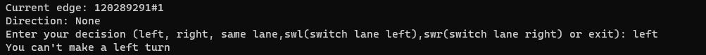
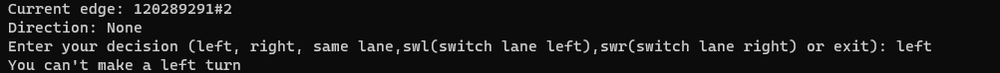

# Internal-Attack-Prevention-in-Vanet
# My Project
Here are four photos:






## Running the Program

To run the program, follow these steps:

1. Clone the repository:
    - ```git clone https://github.com/kumarreddy302/Internal-Attack-Prevention-in-Vanet.git```


2. Navigate to the project directory: 
    - ```cd Internal-Attack-Prevention-in-Vanet```
  

3. Run the program: 
    - ```python main.py```

